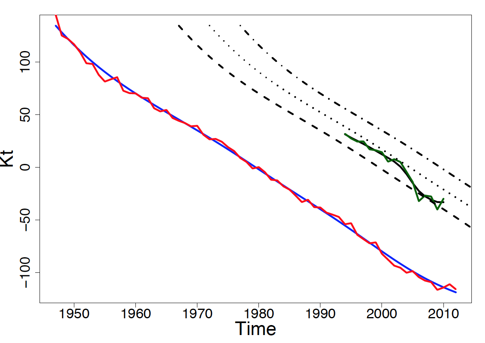
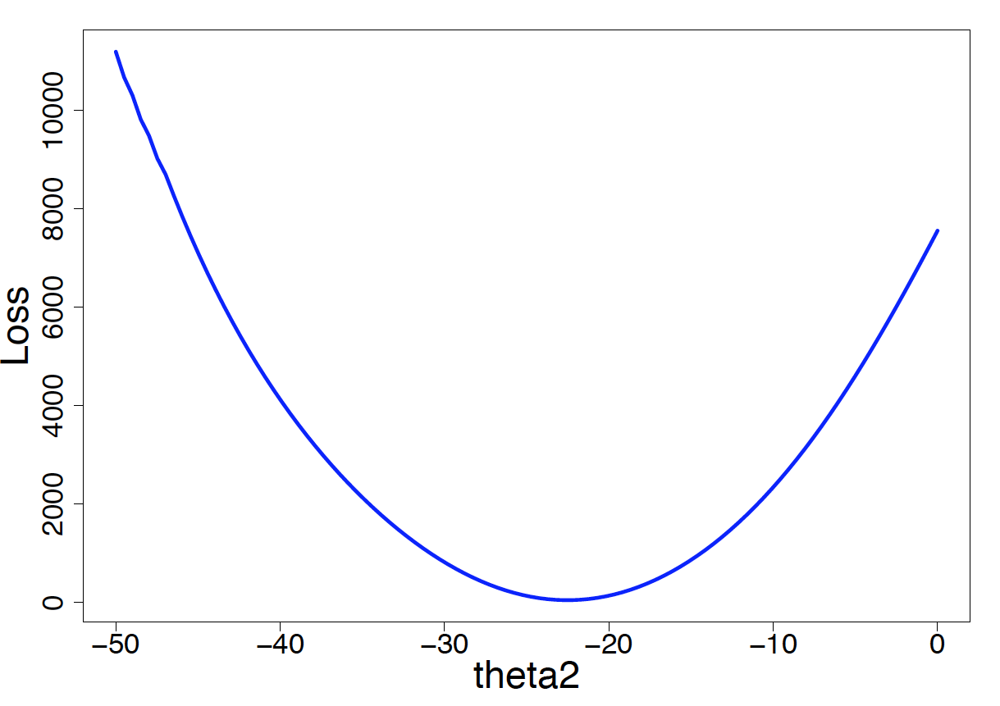
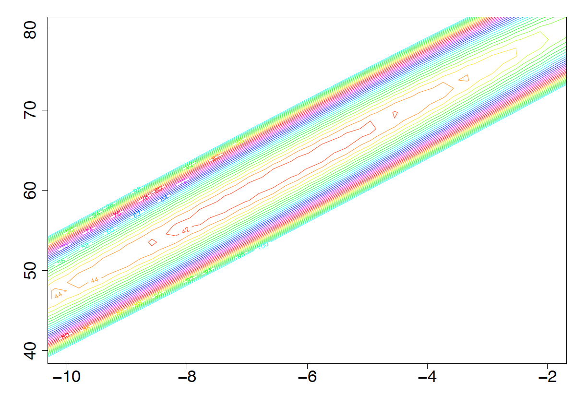
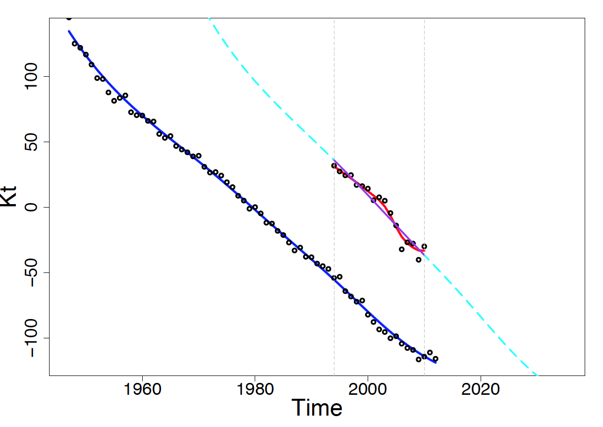

##  **MuPoMo_main_twopop**


```yaml

Name of QuantLet :  MuPoMo_main_twopop

Published in :      MuPoMo (Mortality Model for Multip-populations: A Semiparametric Comparison Approach)

Description :      'Estimates and forecasts mortality rates based on a semi-parametric approach, which applies 
                    parametric modelling for multiple nonparametric curves with the shape-related nonlinear variation. 
                    Uses random two countries to demonstrate two-country case.'

Keywords :         'time series, demography, mortality, population, nonparametric smoothing, parametric modelling, 
                    Lee-Carter method, contour'

See also :         'MuPoMo_data, MuPoMo_optimization, MuPoMo_normalization, 
                    MuPoMo_referencecurve, MuPoMo_main_multipop, MuPoMo_bootstrap'

Author :            Lei Fang

Submitted :         Mon, June 13 2016 by Lei Fang

Example : 
- Time shift at different levels
- Loss function of theta2
- Loss surface 3D
- Contour plot of theta2 and theta4
- Model fit and forecast

```







```R
# clear history and close windows
rm(list=ls(all=TRUE))
graphics.off()

# please set working directory
# setwd("C:/...")     # windows
# setwd("/Users/...") # mac os
# setwd("~/...")      # linux

# install packages
library(demography)
library(rgl)
library(sm)

# set plot
par(mar = c(5, 5, 2, 2), cex.axis = 1.5, cex.lab = 2)

# recall self-defined functions
# read data and compute kt based on Lee-Carter Model via source('data.R')
source('MuPoMo_data.R')
source("MuPoMo_optimization.R")

# choose two countries' kt for this analysis
kt1 = kt.China.female
kt2 = kt.Japan.female

# set bandwidth for smoothing curves
bw.default     = 2.5

# plot kt
plot(kt2, type = "l", col = "blue", lwd = 4, xlab = "Time", ylab = "Kt")
lines(kt1, col = "red", lwd = 4)

# shift movement of the two smoothed countries
t1         = 1994:2010 # differ based on the chosen country
d1         = data.frame(time(kt1), kt1)
h.optimal1 = h.select(time(kt1), kt1)
sm1        = sm.regression(time(kt1), kt1, h = h.optimal1, eval.points = time(kt1), model = "none", poly.index = 1, display = "none")
sm.kt1     = sm1$estimate  # smoothed kt1

t2         = 1947:2012 # differ based on the chosen country
d2         = data.frame(time(kt2), kt2)
h.optimal2 = h.select(time(kt2), kt2)
sm2        = sm.regression(time(kt2), kt2, h = h.optimal2, eval.points = time(kt2), model = "none", poly.index = 1, display = "none")
sm.kt2     = sm2$estimate  # smoothed kt2

plot(t2, sm.kt2, type = "l", col = "blue", lwd = 4, xlab = "Time", ylab = "Kt")
lines(kt2, col = "red", lwd = 4)
lines(t1, sm.kt1, lwd = 4)
lines(kt1, col = "darkgreen", lwd = 4)
lines(t2 + 20, sm.kt2, lwd = 4, lty = 2) # differ based on the chosen country
lines(t2 + 25, sm.kt2, lwd = 4, lty = 3)
lines(t2 + 30, sm.kt2, lwd = 4, lty = 4)

# time delay
plot(t2, sm.kt2, type = "l", col = "blue", lwd = 4, xlab = "Time", ylab = "Kt")
lines(t1, sm.kt1, lwd = 4)
lines(t2 + 23, sm.kt2, lwd = 4, lty = 4, col = "blue") # differ based on the chosen country

# vertical shift
plot(t2, sm.kt2, type = "l", col = "blue", lwd = 4, xlab = "Time", ylab = "Kt")
lines(t1, sm.kt1, lwd = 4)
lines(t2, sm.kt2 + 85, lwd = 4, lty = 4, col = "blue") # differ based on the chosen country

# optimization
theta.2pop  = c(1, -23, 1) # differ based on the chosen country
result.2pop = optimization(theta.2pop, kt1, kt2)

# plot optimized movement
plot(t2, sm.kt2, type = "l", col = 4, lwd = 4, xlab = "Time", ylab = "Kt")
lines(kt2, type = "p", lwd = 3)
lines(t1, sm.kt1, lwd = 4, col = 2)
lines(kt1, type = "p", lwd = 3)
lines(result.2pop[[2]], col = 5, lty = 5)  #
lines(result.2pop[[3]], col = 5, lwd = 3)  #
abline(v = result.2pop[[4]], col = "gray", lty = 5)
abline(v = result.2pop[[5]], col = "gray", lty = 5)

# plot loss function
loss = function(theta1, theta2, theta3, theta4, t, kt, t.reference, kt.reference) {
    sm.t = (t.reference - theta2)/theta3  # time adjustment
    ## common domain for kt and time-adjusted kt.reference
    tmin = max(min(t), min(sm.t))
    tmax = min(max(t), max(sm.t))
    i0 = which(t >= tmin & t <= tmax)  # index for common domain
    if (length(i0) > 0) {
        t0 = t[i0]
        ## smooth interpolation of shifted kt.reference on common grid
        dref = data.frame(sm.t = sm.t, kt.reference = kt.reference)
        # sm: sm.regression with optimal smoothing parameter
        h.optimal3 = h.select(sm.t, kt.reference)
        sm = sm.regression(sm.t, kt.reference, h = h.optimal3, eval.points = t0, model = "none", poly.index = 1, display = "none")
        mu = theta1 * sm$estimate + theta4
        ## mean squared error at common grid points
        mse = mean((kt[i0] - mu)^2)  # mse of kt and the modelled one
    } else {
        mse = 1e+09
    }
    return(mse)
}

# plot loss function of theta2 and theta4
vtheta2 = seq(-30, 10, len = 100) # differ based on the chosen country
vtheta4 = seq(0, 100, len = 100) # differ based on the chosen country
npar    = length(vtheta2)
res     = matrix(rep(0, 10000), 100, 100)
for (i in 1:npar) {
    for (l in 1:npar) {
        res[i, l] = loss(1, vtheta2[i], 1, vtheta4[l], t1, kt1, t2, kt2)
    }
    res[i, l] = loss(1, vtheta2[i], 1, vtheta4[l], t1, kt1, t2, kt2)
}

persp3d(vtheta2, vtheta4, res, col = "blue", xlab = "theta2", ylab = "theta4", zlab = "Loss")

resnew = res * (res < 5000)
persp3d(vtheta2, vtheta4, resnew, col = "blue", xlab = "theta2", ylab = "theta4", zlab = "Loss")

# contour plot
contour(vtheta2, vtheta4, resnew, col = rainbow(20), nlevels = 20, lwd = 1, xlim = c(-23, 0), ylim = c(0, 80))
contour(vtheta2, vtheta4, res, col = rainbow(20), nlevels = 70, lwd = 1, xlim = c(-23, 0), ylim = c(0, 80), zlim = c(0, 100))
contour(vtheta2, vtheta4, res, col = rainbow(20), nlevels = 70, lwd = 1, xlim = c(-10, -2), ylim = c(40, 80), zlim = c(0, 100))

# plot loss function of theta2
vtheta22 = seq(-50, 0, len = 100) # differ based on the chosen country
npar2    = length(vtheta22)
res2     = rep(0, 100)
for (i in 1:npar2) {
    res2[i] = loss(1, vtheta22[i], 1, 0, t1, kt1, t2, kt2)
}
plot(vtheta22, res2, col = "blue", xlab = "theta2", ylab = "Loss", type = "l", lwd = 4)

# plot loss function of theta4
vtheta42 = seq(40, 140, len = 100) # differ based on the chosen country
npar3    = length(vtheta42)
res3     = rep(0, 100)
for (i in 1:npar3) {
    res3[i] = loss(1, 0, 1, vtheta42[i], t1, kt1, t2, kt2)
}
plot(vtheta42, res3, col = "blue", xlab = "theta4", ylab = "Loss", type = "l", lwd = 4)

# forecast
plot(t2, sm.kt2, type = "l", col = 4, lwd = 4, xlab = "Time", ylab = "Kt", xlim = c(1947, 2035))
lines(kt2, type = "p", lwd = 3)
lines(t1, sm.kt1, lwd = 4, col = 2)
lines(kt1, type = "p", lwd = 3)
lines(result.2pop[[2]], col = 4, lty = 5, lwd = 3)  #
lines(result.2pop[[3]], col = "purple", lwd = 3)  #
abline(v = result.2pop[[4]], col = "gray", lty = 5)
abline(v = result.2pop[[5]], col = "gray", lty = 5)

```
